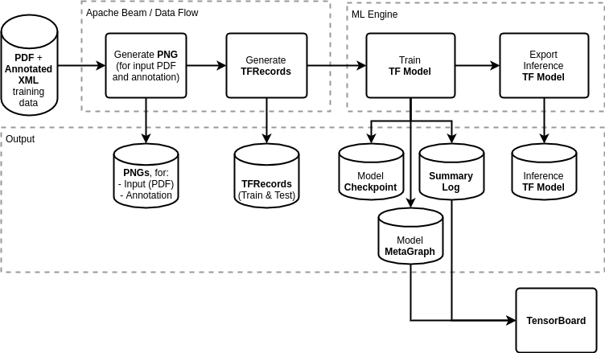
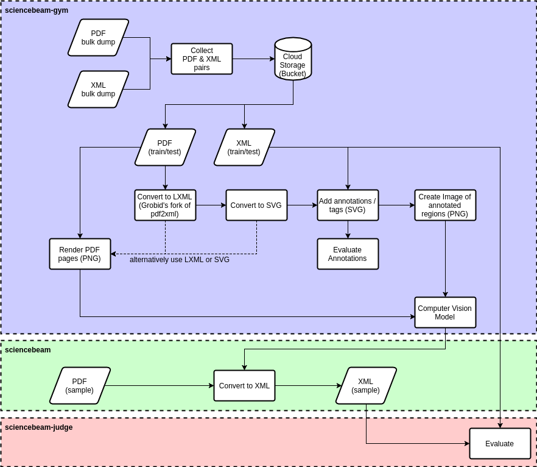

ScienceBeam Gym

This is where the [ScienceBeam](https://github.com/elifesciences/sciencebeam) model is trained.

You can read more about the computer vision model in the [Wiki](https://github.com/elifesciences/sciencebeam-gym/wiki/Computer-Vision-Model).

# Pre-requisites

- Python 2.7 ([currently Apache Beam doesn't support Python 3](https://issues.apache.org/jira/browse/BEAM-1373))
- [Apache Beam](https://beam.apache.org/)
- [TensorFlow](https://www.tensorflow.org/) with google cloud support
- [gsutil](https://cloud.google.com/storage/docs/gsutil)

# Cython

Run:

```bash
python setup.py build_ext --inplace
```

# Local vs. Cloud

Almost all of the commands can be run locally or in the cloud. Simply add `--cloud` to the command to run it in the cloud. You will have to have [gsutil](https://cloud.google.com/storage/docs/gsutil) installed even when running locally.

Before running anything in the cloud, please run `upload-config.sh` to copy the required configuration to the cloud.

# Configuration

The default configuration is in the [prepare-shell.sh](prepare-shell.sh) script. Some of the configuration can be overriden by adding a `.config` file which overrides some of the variables, e.g.:

```bash
#!/bin/bash

export TRAINING_SUFFIX=-gan-1-l1-100
export TRAINING_ARGS="--gan_weight=1 --l1_weight=100"
export USE_SEPARATE_CHANNELS=true
```

### Inspecting Configuration

By running `source prepare-shell.sh` the configuration can be inspected.

e.g. the following sequence of commands will print the data directory:
```bash
source prepare-shell.sh
echo $DATA_PATH
```

The following sections may refer to variables defined by that script.

# Pipeline

The TensorFlow training pipeline is illustrated in the following diagram:



The steps from the diagram are detailed below.

## Preprocessing

The individual steps performed as part of the preprocessing are illustrated in the following diagram:



#### Find File Pairs

The preferred input layout is a directory containing a gzipped pdf (`.pdf.gz`) and gzipped xml (`.nxml.gz`), e.g.:

* manuscript_1/
  * manuscript_1.pdf.gz
  * manuscript_1.nxml.gz
* manuscript_2/
  * manuscript_2.pdf.gz
  * manuscript_2.nxml.gz

Using compressed files is optional but recommended to reduce file storage cost.

The parent directory per manuscript is optional. If that is not the case then the name before the extension must be identical (which is recommended in general).

Run:

```bash
python -m sciencebeam_lab.preprocess.find_file_pairs \
--data-path <source directory> \
--pdf-pattern *.pdf.gz --xml-pattern *.nxml.gz \
--out <output file list csv/tsv>
```

e.g.:

```
python -m sciencebeam_lab.preprocess.find_file_pairs \
--data-path gs://some-bucket/some-dataset \
--pdf-pattern *.pdf.gz --xml-pattern *.nxml.gz \
--out gs://some-bucket/some-dataset/file-list.tsv
```

That will create the TSV (tab separated) file `file-list.tsv` with the following columns:

* _pdf_url_
* _xml_url_

That file could also be generated using any other preferred method.

### Split File List

To separate the file list into a _training_, _validation_ and _test_ dataset, the following script can be used:

```bash
python -m sciencebeam_gym.preprocess.split_csv_dataset \
--input <csv/tsv file list> \
--train 0.5 --validation 0.2 --test 0.3 --random --fill
```

e.g.:

```bash
python -m sciencebeam_gym.preprocess.split_csv_dataset \
--input gs://some-bucket/some-dataset/file-list.tsv \
--train 0.5 --validation 0.2 --test 0.3 --random --fill
```

That will create three separate files in the same directory:

* `file-list-train.tsv`
* `file-list-validation.tsv`
* `file-list-test.tsv`

The file pairs will be randomly selected (_--random_) and one group will also include all remaining file pairs that wouldn't get include due to rounding (_--fill_).

As with the previous step, you may decide to use your own process instead.

Note: those files shouldn't change anymore once you used those files

### Preprocess

The output of this step are the [TFRecord](https://www.tensorflow.org/programmers_guide/datasets) files used by the training process. TFRecord files are a bit like binary csv files.

The input files are pairs of PDF and XML files (using file lists generated in the previous steps).

Run:

```
./preprocess.sh [--cloud]
```

That will run the preprocessing pipeline for:

* training dataset using `file-list-train.tsv`
* validation dataset using `file-list-validation.tsv`
* qualitative dataset using first _n_ files and first page of `file-list-validation.tsv` (optional)

Part of the preprocessing is an auto-annotation step which aligns text from the XML with the text in the PDF to tag the corresponding regions appropriately. It is using the [Smith Waterman algorithm](https://en.wikipedia.org/wiki/Smith_waterman). It may take some time (roughly 6 seconds per page). It will also make mistakes but for the samples we used it was good enough.

You can inspect some details (e.g. count) of the resulting TFRecords by running the following command:

```bash
./inspect-tf-records.sh [--cloud]
```

## Train TF Model

Running the following command will train the model:

```bash
./train.sh [--cloud]
```

## Export Inference Model

This step is currently not implemented.

## TensorBoard

Run the TensorBoard with the correct path:

```bash
./tensorboard.sh [--cloud]
```

# Visual Studio Code Setup

If you are using [Visual Studio Code](https://code.visualstudio.com/) and are using a virtual environment for Python, you can add the following entry to `.vscode/settings.json`:
```json
"python.pythonPath": "${workspaceRoot}/venv/bin/python"
```

And then create link to the virtual environment as `venv`.
